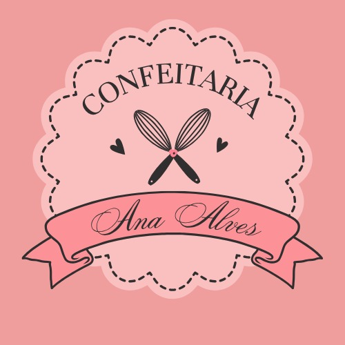

🧁 Confeitaria Ana Alves

<div align="center">
  
  
  Adoçando o seu momento especial
  
  [](https://developer.mozilla.org/pt-BR/docs/Web/HTML)
  [](https://developer.mozilla.org/pt-BR/docs/Web/CSS)
  [](https://developer.mozilla.org/pt-BR/docs/Web/JavaScript)
</div>


📋 Sobre o projeto

Website desenvolvido como projeto acadêmico para a *Confeitaria Ana Alves*, uma confeitaria artesanal especializada em doces personalizados feitos com amor e ingredientes selecionados. O site oferece uma experiência completa para os clientes, desde a visualização do portfólio até o sistema de encomendas personalizadas.

🎯 Objetivo

Criar uma plataforma digital que:
- Apresente os produtos da confeitaria de forma atrativa
- Permita encomendas personalizadas via WhatsApp
- Conte a história inspiradora da empreendedora
- Ofereça uma experiência de usuário moderna e intuitiva

---

✨ Funcionalidades

🏠 Páginas principais

- **Home (index.html)**: Página inicial com apresentação e destaques
- **História (historia.html)**: Timeline interativa contando a jornada da confeitaria
- **Cardápio (cardapio.html)**: Menu completo com preços e descrições
- **Portfólio (portifolio.html)**: Galeria de fotos dos produtos com carrosséis
- **Encomenda (encomenda.html)**: Formulário completo para pedidos personalizados
- **Contato (contato.html)**: Formulário de contato e informações

👤 Sistema de usuário

- **Login (login.html)**: Sistema de autenticação
- **Registro (registro.html)**: Cadastro de novos usuários com validações
- **Perfil (perfil-usuario.html)**: Página de perfil editável com estatísticas
- **Configurações (configuracoes.html)**: Gerenciamento de preferências, endereços e notificações
- **Notificações (notificacoes.html)**: Central de notificações com filtros
- **Recuperar senha (recuperar-senha.html)**: Sistema de recuperação de senha

🎨 Recursos interativos

- **Carrosséis de imagens**: Navegação suave entre fotos dos produtos
- **Timeline interativa**: História da confeitaria em formato de linha do tempo
- **Formulários validados**: Validação em tempo real dos campos
- **Sistema de busca**: Busca na central de ajuda
- **Dropdown de usuário**: Menu contextual com ações rápidas
- **Integração WhatsApp**: Envio direto de pedidos via WhatsApp

---

🛠️ Tecnologias utilizadas

💠 Frontend
- **HTML5**: Estruturação semântica das páginas
- **CSS3**: Estilização avançada com gradientes, animações e responsividade
- **JavaScript (Vanilla)**: Interatividade e manipulação do DOM

💠 Bibliotecas e recursos
- **Font Awesome 6.4.0**: Ícones vetoriais
- **Google Fonts**: Tipografia personalizada
- **Unsplash/Custom Images**: Imagens de alta qualidade

💠 Práticas e técnicas
- Design Responsivo (Mobile-first)
- Animações CSS e JavaScript
- Validação de formulários
- LocalStorage (simulação)
- Máscaras de input
- Carrosséis customizados

---

📁 Estrutura do projeto

```
CONFEITARIA-ANA-ALVES/
│
├── assets/
│   ├── images/
│   │   ├── Home/           # Imagens da página inicial
│   │   ├── Icons/          # Ícones customizados
│   │   ├── Logo/           # Logotipos
│   │   ├── Portfolio/      # Fotos dos produtos
│   │   ├── User/           # Avatares de usuário
│   │   └── public/         # Imagens públicas
│   │
│   └── style/
│       ├── ajuda.css
│       ├── cardapio.css
│       ├── configuracoes.css
│       ├── contato.css
│       ├── encomenda.css
│       ├── footer.css
│       ├── historia.css
│       ├── index.css
│       ├── login.css
│       ├── menu.css
│       ├── menu-home.css
│       ├── notificacoes.css
│       ├── perfil-usuario.css
│       ├── portifolio.css
│       ├── recuperar-senha.css
│       └── registro.css
│
├── ajuda.html
├── cardapio.html
├── configuracoes.html
├── contato.html
├── encomenda.html
├── historia.html
├── index.html
├── login.html
├── notificacoes.html
├── perfil-usuario.html
├── portifolio.html
├── recuperar-senha.html
├── registro.html
└── preview-confeitaria.jpg
```

---

🚀 Como Executar o Projeto

⚪ Pré-requisitos
- Navegador web moderno (Chrome, Firefox, Edge, Safari)
- Editor de código (VS Code, Sublime Text, etc.) - opcional

⚪ Instalação

1. **Clone o repositório**
```bash
git clone https://github.com/seu-usuario/confeitaria-ana-alves.git
```

2. **Acesse o diretório**
```bash
cd confeitaria-ana-alves
```

3. **Abra o projeto**
- Opção 1: Abra o arquivo `index.html` diretamente no navegador
- Opção 2: Use a extensão Live Server do VS Code
- Opção 3: Configure um servidor local

⚪ Usando Live Server (Recomendado)

1. Instale a extensão **Live Server** no VS Code
2. Clique com botão direito em `index.html`
3. Selecione "Open with Live Server"
4. O projeto abrirá automaticamente em `http://localhost:5500`

---

📱 Páginas e navegação

Fluxo do usuário

```
Index (Home)
    ├── História
    ├── Cardápio
    ├── Portfólio
    ├── Encomenda → WhatsApp
    ├── Contato
    └── Login
        ├── Registro
        ├── Recuperar Senha
        └── [Área Logada]
            ├── Perfil
            ├── Configurações
            ├── Notificações
            └── Ajuda
```

---

🎨 Paleta de cores

```css
--primary: #8C5660      /* Rosê escuro */
--secondary: #664B44    /* Marrom */
--accent1: #fabfbf      /* Rosa claro */
--accent2: #ef9d9d      /* Rosa médio */
--accent3: #D9B0B7      /* Rosa pálido */
--dark: #261417         /* Marrom escuro */
--white: #FFFFFF        /* Branco */
```

---

📊 Funcionalidades detalhadas

🛒 Sistema de encomendas

O formulário de encomendas permite:
- Personalização de bolos (massa, recheio, peso)
- Customização de brownies (recheio, embalagem)
- Seleção de brigadeiros, beijinhos, pudins e tarteletes
- Campo para descrição detalhada
- Seleção de data e horário de entrega
- Integração direta com WhatsApp

**Exemplo de envio:**
```
🧁 PEDIDO DE ENCOMENDA

👤 DADOS DO CLIENTE:
• Nome: João Silva
• E-mail: joao@email.com
• WhatsApp: (61) 99999-9999

🚚 ENTREGA:
• Data: 30/11/2025
• Horário: 15:00

🎂 BOLOS:
• Massa: chocolate
• Recheio: brigadeiro tradicional
• Peso: 2kg
• Quantidade: 1

🫧 DETALHES ADICIONAIS:
Decoração tema aniversário infantil
```

📸 Galeria de portfólio

- 6 categorias de produtos
- Carrosséis independentes com múltiplas imagens
- Navegação por setas ou indicadores
- Auto-play opcional
- Transições suaves

📖 História da confeitaria

Timeline interativa com 5 marcos principais:
1. **Dez 2020**: O recomeço dos sonhos
2. **2021**: Primeiros passos
3. **2022**: Crescimento com propósito
4. **2023**: Consolidação da fé
5. **2024**: Sonhos realizados

⚙️ Sistema de configurações

- Gerenciamento de dados pessoais
- Múltiplos endereços de entrega
- Preferências de notificações
- Restrições alimentares
- Produtos favoritos
- Preferências de entrega

---

🔒 Recursos de segurança

- Validação de formulários no cliente
- Máscaras de input (telefone, CEP)
- Verificação de força de senha
- Confirmação de senha
- Validação de e-mail
- Campos obrigatórios marcados

---

📞 Informações de contato

- **WhatsApp**: (61) 98565-3068
- **E-mail**: confeitarianalves@gmail.com
- **Instagram**: @analvesconfeitaria
- **Horário**: Seg-Dom: 9h às 18h
- **Localização**: Recanto das Emas, DF

---

🎓 Informações acadêmicas

🟣 Desenvolvedoras
- **Lia Costa**
- **Sarah Gabriel**

🟣 Contexto
Projeto desenvolvido como trabalho acadêmico para apresentar habilidades em:
- Desenvolvimento Web Frontend

---

📈 Melhorias futuras

- [ ] Backend com Node.js/Express
- [ ] Banco de dados (MongoDB/PostgreSQL)
- [ ] Sistema de pagamento online
- [ ] Painel administrativo
- [ ] Sistema de avaliações
- [ ] Chat em tempo real
- [ ] PWA (Progressive Web App)
- [ ] Testes automatizados
- [ ] CI/CD Pipeline
- [ ] Otimização de imagens
- [ ] SEO avançado
- [ ] Analytics integrado

---

🐛 Problemas conhecidos

> **Nota**: Como este é um projeto acadêmico frontend, algumas funcionalidades são simuladas:
> - Login/Registro não persiste dados reais
> - Envio de e-mails é simulado
> - Sistema de notificações é estático
> - Configurações não salvam permanentemente

---

📝 Licença

Este projeto foi desenvolvido para fins educacionais.

**© 2025 Confeitaria Ana Alves. Todos os direitos reservados.**

---

🤝 Contribuições

Este é um projeto acadêmico, mas sugestões e melhorias são bem-vindas!

1. Faça um Fork do projeto
2. Crie uma branch para sua feature (`git checkout -b feature/MinhaFeature`)
3. Commit suas mudanças (`git commit -m 'Adiciona MinhaFeature'`)
4. Push para a branch (`git push origin feature/MinhaFeature`)
5. Abra um Pull Request

---

📸 Screenshots

### Home


### Portfólio
*Galeria interativa com carrosséis de imagens dos produtos*

### Sistema de encomendas
*Formulário completo para pedidos personalizados*

---

## 🌟 Agradecimentos

- **Ana Alves** - Por inspirar este projeto com sua história real de empreendedorismo
- **Font Awesome** - Pelos ícones
- **Unsplash** - Pelas imagens de qualidade
- **Comunidade de Desenvolvedores** - Pelo conhecimento compartilhado

---

<div align="center">
  
  ### Feito com 💖 e muito 🍰
  
  **[⬆ Voltar ao topo](#-confeitaria-ana-alves)**

</div>
